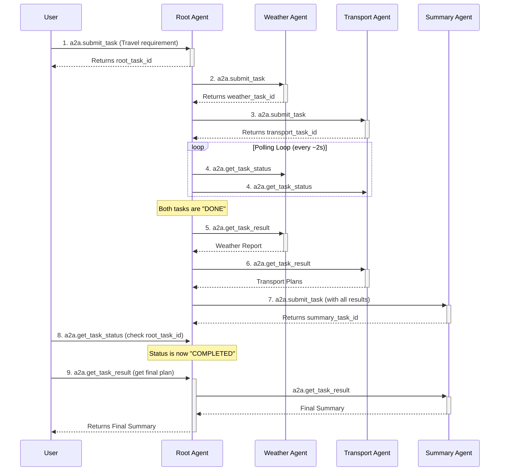

# AI Agent A2A Travel Planner Project (Async Architecture)

This project demonstrates a multi-agent system for handling travel queries, showcasing a robust, asynchronous agent-to-agent (A2A) communication protocol. The `root-agent` acts as a central orchestrator, receiving user requests, dispatching tasks to specialized `remote-agents` (for weather and transport), and finally aggregating the results into a comprehensive travel plan via a `summary-agent`.

The core of this project is its asynchronous, non-blocking architecture, which is ideal for workflows involving long-running tasks.

## System Architecture

The system is built on a microservices architecture, with each agent operating as an independent service.

-   **Root Agent**: The user's primary point of contact. It manages the entire task lifecycle using a **LangGraph** state machine.
-   **Remote Agent 1 (Weather)**: Provides weather forecasts.
-   **Remote Agent 2 (Transport)**: Provides transportation plans.
-   **Summary Agent**: Synthesizes information from the other agents into a final, user-friendly summary.

### Asynchronous Communication Protocol

Communication between agents is handled via **JSON-RPC 2.0 over HTTP**, following a classic three-step asynchronous pattern:

1.  **`a2a.submit_task`**: The client (e.g., `root-agent`) sends a task to a server (e.g., `remote-agent-1`). The server immediately acknowledges the request and returns a unique `task_id`.
2.  **`a2a.get_task_status`**: The client periodically calls this method with the `task_id` to check the task's status (e.g., `PENDING`, `IN_PROGRESS`, `DONE`).
3.  **`a2a.get_task_result`**: Once the status is `DONE`, the client calls this method with the `task_id` to retrieve the final result.

This pattern ensures that the client is never blocked waiting for a long process to finish.

### Workflow

The end-to-end process for a user request is as follows:



## Getting Started

Follow these instructions to deploy and test the system.

### Prerequisites
-   `aws` CLI configured with appropriate IAM permissions.
-   `kubectl` installed and configured to connect to your EKS cluster.

### Deployment
The services are designed to be deployed on Kubernetes. All necessary YAML files are in the `kubernetes/` directory. You can deploy them using `kubectl apply -f <filename>`.

For detailed instructions on each agent's configuration, refer to the `README.md` inside its respective service directory (e.g., `services/root-agent/README.md`).

## End-to-End Testing from Your Terminal

This example shows how to interact with the deployed system to plan a trip from Taipei to Tainan.

**Prerequisite**: Use `kubectl port-forward` to make the `root-agent` accessible from your local machine.
```bash
# Forward the root-agent's service port 50000 to your local port 50000
kubectl port-forward -n a2a-demo svc/root-agent-service 50000:50000
```

### Step 1: Submit Your Travel Request

This command initiates the entire workflow. The `root-agent` will return a `task_id` for you to track the progress.

```bash
curl -X POST http://127.0.0.1:50000/jsonrpc \
  -H "Content-Type: application/json" \
  -d '{
        "jsonrpc": "2.0",
        "method": "a2a.submit_task",
        "params": {
          "loan_case_id": "trip-to-tainan-001",
          "user_requirement": {
            "origin": "台北",
            "destination": "台南",
            "travel_date": "2024-10-25",
            "desired_arrival_time": "15:30"
          }
        },
        "id": 1
      }'
```

**Response:**
```json
{
  "jsonrpc": "2.0",
  "result": {
    "task_id": "xxxxxxxx-xxxx-xxxx-xxxx-xxxxxxxxxxxx", // <-- COPY THIS ID
    "message": "Workflow started."
  },
  "id": 1
}
```

### Step 2: Check the Task Status

Periodically run this command to see the workflow's progress. The status will change from `POLLING` to `SUMMARIZING` and finally to `COMPLETED`.

```bash
# Replace YOUR_TASK_ID_HERE with the ID from Step 1
curl -X POST http://127.0.0.1:50000/jsonrpc \
  -H "Content-Type: application/json" \
  -d '{
        "jsonrpc": "2.0",
        "method": "a2a.get_task_status",
        "params": {
          "task_id": "YOUR_TASK_ID_HERE"
        },
        "id": 2
      }'
```

**Response (while in progress):**
```json
{
    "jsonrpc": "2.0",
    "result": {
        "task_id": "YOUR_TASK_ID_HERE",
        "status": "POLLING"
    },
    "id": 2
}
```

### Step 3: Retrieve the Final Result

Once the status is `COMPLETED`, run this command to get your final travel plan.

```bash
# Replace YOUR_TASK_ID_HERE with the ID from Step 1
curl -X POST http://127.0.0.1:50000/jsonrpc \
  -H "Content-Type: application/json" \
  -d '{
        "jsonrpc": "2.0",
        "method": "a2a.get_task_result",
        "params": {
          "task_id": "YOUR_TASK_ID_HERE"
        },
        "id": 3
      }'
```

**Response (final plan):**
```json
{
    "jsonrpc": "2.0",
    "result": {
        "task_id": "YOUR_TASK_ID_HERE",
        "status": "COMPLETED",
        "result": {
            "task_id": "YOUR_TASK_ID_HERE",
            "overview": "為您規劃的從台北到台南的行程...",
            "weather_advice": "台南天氣晴朗，建議穿著輕便...",
            "transport_options": "建議您搭乘高鐵..."
        }
    },
    "id": 3
}
```
---
_This README file has been updated by an AI agent to reflect the new asynchronous architecture._
