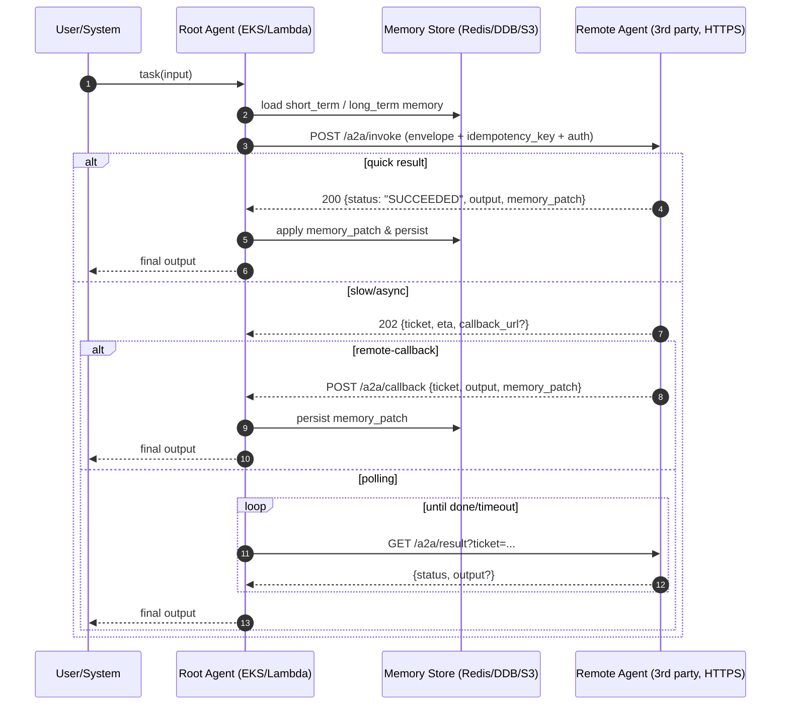

# a2a_cash_flow_demo

專案架構：

```md
a2a-ds-cashflow-demo/
├─ services/
│   ├─ jsonrpc_gateway/               # JSON-RPC 測試 server/client、README 與 TLS 範例
│   │   ├─ client.py
│   │   ├─ server.py
│   │   └─ README.md
│   ├─ remote-agent-1/                # Weather Remote Agent（提供隨機天氣摘要與行前提醒）
│   ├─ remote-agent-2/                # Train Agent (agent 2)
│   ├─ summary-agent/                 # Summary Agent（彙整 Weather/Train 結果）
│   └─ root-agent/                    # Root Agent FastAPI 應用，支援 JSON-RPC 與 EventBridge/SQS
│       └─ app/
│           ├─ main.py
│           ├─ models.py
│           └─ a2a/
│               ├─ graph.py
│               └─ tools.py
├─ kubernetes/
│   ├─ cicd.sh                        # EventBridge/SQS 佈署腳本
│   ├─ cicd_jsonrpc.sh                # JSON-RPC over HTTPS 測試腳本
│   ├─ configmap-agent-models.yaml    # 各 Agent LLM 模型設定
│   ├─ deployment-root.yaml           # Root Agent Deployment（含 JSON-RPC feature flag）
│   ├─ deployment-remote1.yaml        # Weather Agent Deployment
│   ├─ deployment-remote2.yaml        # Train Agent Deployment
│   ├─ deployment-summary.yaml        # Summary Agent Deployment
│   ├─ namespace.yaml
│   ├─ service-jsonrpc.yaml           # Root Agent JSON-RPC 專用 ClusterIP（Pod-to-Pod / 內部測試）
│   ├─ service-root.yaml              # Root Agent 內部 ClusterIP（EventBridge/SQS 回呼）
│   ├─ service-remote1.yaml
│   ├─ service-remote2.yaml
│   └─ service-summary.yaml
├─ terraform/
│   ├─ main.tf
│   └─ README.md
└─ README.md
```

## Root 與 Remote Agents 互動流程

專案中的 Root Agent 會根據使用者需求協調多個 Remote Agents 取得所需資訊：

1. **使用者請求**：Root Agent FastAPI 服務透過 JSON-RPC 或事件驅動介面接收使用者問題與上下文。
2. **下游呼叫**：Root Agent 依據任務將請求分派給 Remote Agent 1（天氣摘要）、Remote Agent 2（交通資訊規劃）以及 Summary Agent（整合回報）。
3. **資料蒐集**：
   - Remote Agent 1 產生指定地點的天氣摘要與行前提醒。
   - Remote Agent 2 隨機生成符合抵達時間限制的交通班次資訊。
   - Summary Agent 接收前述兩個 Remote Agents 的結果並整理為最終摘要。
4. **回傳結果**：Root Agent 收到下游輸出後會進行彙整（必要時由 Summary Agent 協助），並將整體回覆返回給使用者或上游系統。

這個流程讓 Root Agent 能夠集中協調多個專責的 Remote Agents，同時保持各服務的獨立部署與測試流程。

```
使用者/測試客戶端
        │  POST /tasks 或 JSON-RPC
        ▼
    Root Agent
   ┌────┴──────────────────────────┐
   │                                │
   │HTTP 呼叫                       │HTTP 呼叫
   ▼                                ▼
Weather Agent (/weather/report)   Transport Agent (/transport/plans)
   │                                │
   └──────────────┬────────────────┘
                  ▼ HTTP 呼叫
            Summary Agent (/summaries)
                  │
                  ▼
             Root Agent 整合回傳
```

### (後續刪除) 同步本地分支

我的開發 master branch - dev_root_agent, 在跟 codex 協作時, 當我在 github page merge PR 並刪除分支, 需用下面指令同步回來

```
# 原本狀態 - git branch -vv
sagemaker-user@default:~/a2a_cash_flow_demo$ git branch -vv
  codex/-root-agent-remote-agents                       dc99dec [origin/codex/-root-agent-remote-agents] Align JSON-RPC service port and clarify POST calls
  codex/add-transport-info-generation-to-remote-agent-2 a9ba0f0 [origin/codex/add-transport-info-generation-to-remote-agent-2: gone] Document agent coordination and update RA2 guide
  codex/develop-remote-agent-weather-with-tests         fd20108 [origin/codex/develop-remote-agent-weather-with-tests: gone] Fix date field alias for weather agent models
  codex/implement-summary-agent-with-user-suggestions   a20b778 [origin/codex/implement-summary-agent-with-user-suggestions: gone] refactor: align summary main with remote agent style
  codex/update-terraform-and-kubernetes-files           98d9257 [origin/codex/update-terraform-and-kubernetes-files: gone] Update CI/CD script for all agents
* dev_root_agent                                        5004ffb Merge pull request #5 from AmberFu/codex/implement-summary-agent-with-user-suggestions
  dev_simple_a2a_core                                   ada0e94 Update new a2a demo setup and task
  main                                                  15dcb95 [origin/main] Merge pull request #1 from AmberFu/dev_root_agent

# 查看特定遠端版本資料庫 repository 的詳細資訊 - git remote show origin
sagemaker-user@default:~/a2a_cash_flow_demo$ git remote show origin
* remote origin
  Fetch URL: https://github.com/AmberFu/a2a_cash_flow_demo.git
  Push  URL: https://github.com/AmberFu/a2a_cash_flow_demo.git
  HEAD branch: main
  Remote branches:
    dev_root_agent                                      tracked
    dev_simple_a2a_core                                 tracked
    main                                                tracked
    refs/remotes/origin/codex/-root-agent-remote-agents stale (use 'git remote prune' to remove)
  Local branches configured for 'git pull':
    codex/-root-agent-remote-agents                       merges with remote codex/-root-agent-remote-agents
    codex/add-transport-info-generation-to-remote-agent-2 merges with remote codex/add-transport-info-generation-to-remote-agent-2
    codex/develop-remote-agent-weather-with-tests         merges with remote codex/develop-remote-agent-weather-with-tests
    codex/implement-summary-agent-with-user-suggestions   merges with remote codex/implement-summary-agent-with-user-suggestions
    codex/update-terraform-and-kubernetes-files           merges with remote codex/update-terraform-and-kubernetes-files
    main                                                  merges with remote main
  Local refs configured for 'git push':
    dev_root_agent      pushes to dev_root_agent      (local out of date)
    dev_simple_a2a_core pushes to dev_simple_a2a_core (up to date)
    main                pushes to main                (up to date)

# 修剪的分支清單 - git remote prune origin
sagemaker-user@default:~/a2a_cash_flow_demo$ git remote prune origin
Pruning origin
URL: https://github.com/AmberFu/a2a_cash_flow_demo.git
 * [pruned] origin/codex/-root-agent-remote-agents


# 同步分支 - git pull origin dev_root_agent
sagemaker-user@default:~/a2a_cash_flow_demo$ git pull origin dev_root_agent
From https://github.com/AmberFu/a2a_cash_flow_demo
 * branch            dev_root_agent -> FETCH_HEAD
Updating 5004ffb..75dc477
Fast-forward
 README.md                            | 130 +++++++++++++++++++++++++++++++++++++++++++++++++++++++++++++++++++++++++++++++++++++++++++++++++++-
 kubernetes/deployment-remote1.yaml   |   2 ++
...
services/summary-agent/app/main.py   |   7 +++++-
 14 files changed, 606 insertions(+), 118 deletions(-)


# 再度確認
sagemaker-user@default:~/a2a_cash_flow_demo$ git remote show origin
* remote origin
  Fetch URL: https://github.com/AmberFu/a2a_cash_flow_demo.git
  Push  URL: https://github.com/AmberFu/a2a_cash_flow_demo.git
  HEAD branch: main
  Remote branches:
    dev_root_agent      tracked
    dev_simple_a2a_core tracked
    main                tracked
  Local branches configured for 'git pull':
    codex/-root-agent-remote-agents                       merges with remote codex/-root-agent-remote-agents
    codex/add-transport-info-generation-to-remote-agent-2 merges with remote codex/add-transport-info-generation-to-remote-agent-2
    codex/develop-remote-agent-weather-with-tests         merges with remote codex/develop-remote-agent-weather-with-tests
    codex/implement-summary-agent-with-user-suggestions   merges with remote codex/implement-summary-agent-with-user-suggestions
    codex/update-terraform-and-kubernetes-files           merges with remote codex/update-terraform-and-kubernetes-files
    main                                                  merges with remote main
  Local refs configured for 'git push':
    dev_root_agent      pushes to dev_root_agent      (up to date)
    dev_simple_a2a_core pushes to dev_simple_a2a_core (up to date)
    main                pushes to main                (up to date)

```

### 如何在本地端跑完整流程並觀察 Remote Agents

1. **啟動或 Port-Forward 服務**：
   - Root Agent：`kubectl port-forward -n a2a-demo service/root-agent-service 50000:50000`
   - Weather Agent：`kubectl port-forward -n a2a-demo service/remote-agent-1-service 50001:50001`
   - Transport Agent：`kubectl port-forward -n a2a-demo service/remote-agent-2-service 50002:50002`
   - Summary Agent：`kubectl port-forward -n a2a-demo service/summary-agent-service 50003:50003`
   若 Root Agent 與 Remote Agents 同樣在叢集內執行，只有對外測試時才需要 port-forward；叢集內部呼叫會直接透過上述 Service DNS。

2. **切換 Root Agent 為本地直接呼叫模式**：預設 `A2A_WORKFLOW_MODE=eventbridge` 會將事件送到 AWS EventBridge，需要完整的 EventBridge + SQS/DynamoDB 流程才能看到 Remote Agent 的輸入。若僅需在本地驗證 HTTP 呼叫，請以環境變數覆寫：

   ```bash
   export A2A_WORKFLOW_MODE=local
   export A2A_USE_DDB_CHECKPOINTER=false  # 若沒有設定 DynamoDB 也可以關閉
   ```

   重新啟動 Root Agent 後，它會直接以 HTTP 呼叫 Remote Agent 服務並在同一個回應中回傳 Summary。

3. **發送測試請求**：

   ```bash
   curl -s -X POST http://127.0.0.1:50000/tasks \
     -H "Content-Type: application/json" \
     -d '{
           "loan_case_id": "demo-case-001",
           "user_requirement": {
             "origin": "台北",
             "destination": "台南",
             "travel_date": "2024-10-25",
             "desired_arrival_time": "15:30",
             "transport_note": "希望下午抵達參加會議"
           }
         }'
   ```

4. **查閱 Log 確認訊息流向**：
   - Root Agent：`kubectl logs deploy/root-agent -n a2a-demo -f | grep "Calling"` 可看到 `Calling Weather Remote Agent via POST` / `Calling Transport Remote Agent via POST` / `Calling Summary Agent via POST` 訊息。
   - Weather Agent：`kubectl logs deploy/remote-agent-1 -n a2a-demo -f | grep Generating`。
   - Transport Agent：`kubectl logs deploy/remote-agent-2 -n a2a-demo -f | grep Generating`。
   - Summary Agent：`kubectl logs deploy/summary-agent -n a2a-demo -f | grep Generating`。

   若只看到 Root Agent 的 log，通常表示仍在 EventBridge 模式或 HTTP 呼叫失敗。切換模式並檢查 `REMOTE*_URL` 是否指向正確的 ClusterIP/port。

5. **JSON-RPC 測試與追蹤**：啟用 `JSONRPC_ENABLED=true` 並 port-forward `service-jsonrpc.yaml`（`kubectl port-forward -n a2a-demo service/root-agent-jsonrpc 50000:50000`）後，可用 `services/jsonrpc_gateway/client.py` 送出 `a2a.submit_task` 取得同步結果。下列步驟可協助確認 Remote Agent 也有收到請求：
   - 送出請求：

     ```bash
     python services/jsonrpc_gateway/client.py --endpoint http://127.0.0.1:50000/jsonrpc --method a2a.submit_task \
       --payload '{"loan_case_id": "demo-jsonrpc-001", "user_requirement": {"origin": "台北", "destination": "台南", "travel_date": "2024-10-25", "desired_arrival_time": "15:30"}}'
     ```

   - Root Agent 日誌：`kubectl logs deploy/root-agent -n a2a-demo -f | grep "via POST"`，應看到 `Calling Weather Remote Agent via POST` 等訊息，代表 JSON-RPC 任務已轉為 HTTP 呼叫。
   - Remote Agents 日誌：分別追 `deploy/remote-agent-1`、`deploy/remote-agent-2`、`deploy/summary-agent`，可看到 `Generating weather report`、`Generating transport plans`、`Aggregating remote agent outputs` 等字樣。
   - 二次驗證：必要時可重送 `curl -X POST` 測試到個別 Remote Agent（參考上方步驟 4），確保 port-forward 仍然有效且服務可回應。

   如需在 JSON-RPC 流程下保留請求與回應紀錄，可啟用 Root Agent 的 `A2A_USE_DDB_CHECKPOINTER=true`，或在 Remote Agent 中自行記錄 request body 與 `task_id`。

### 為什麼看不到 Remote Agent 的 log？

* Root Agent 在 `A2A_WORKFLOW_MODE=eventbridge` 下只會將事件送到 EventBridge，Remote Agent 會透過 SQS/EventBridge 的整合接收。若未部署這些 AWS 元件或未執行 Lambda/SQS 接收程式，就不會有 log。
* 若已切換到本地模式仍看不到 log，請確認：
  1. `REMOTE1_URL`、`REMOTE2_URL`、`SUMMARY_URL` 是否皆可從 Root Agent 解析（叢集內部署時，預設應為 `http://remote-agent-1-service:50001`、`http://remote-agent-2-service:50002`、`http://summary-agent-service:50003`）。
  2. Remote Agent Pod 是否存活：`kubectl get pods -n a2a-demo`。
  3. HTTP 連線是否成功：請以 **POST** 方法測試，例如：

     ```bash
     curl -s -X POST http://127.0.0.1:50001/weather/report \
       -H "Content-Type: application/json" \
       -d '{
             "city": "台南",
             "date": "2024-10-25",
             "time_range": "下午"
           }'
     ```

     若看到 JSON 回應表示 Remote Agent 已正確收到請求，並會在 log 中輸出 `Generating weather report` 字樣。

### `GET /weathar/report` 405 Method Not Allowed 排除方式

* Weather Remote Agent 只提供 `POST /weather/report` 端點；若以 GET 方法測試（或路徑拼寫為 `weathar`），FastAPI 會回傳 405。
* 檢查 Root Agent log（`kubectl logs deploy/root-agent -n a2a-demo -f | grep "Calling Weather"`）應可看到 `Calling Weather Remote Agent via POST: http://…/weather/report`，代表 Root Agent 會使用 POST 發送。【F:services/root-agent/app/a2a/tools.py†L145-L163】
* 若仍出現 405，請再次確認：
  1. `REMOTE1_URL` 是否被錯誤設定成帶有 `/weathar` 等子路徑，導致實際請求路徑錯誤。
  2. 手動測試時務必傳送 POST 並附上 JSON 主體（如上範例）。
  3. 查看 Remote Agent log 內是否有 `Generating weather report for city=…` 之類的訊息，確定程式有進入處理函式。【F:services/remote-agent-1/app/main.py†L69-L92】

完成以上檢查後，重新透過 Root Agent 發送一次 `/tasks` 請求，並對照 Root Agent 與 Weather Agent 的 log，即可確認訊息流向正常。

### 控制 `/metrics` 擷取頻率或停用

所有 FastAPI 服務都已支援 `METRICS_ENABLED` 環境變數：

```bash
export METRICS_ENABLED=false  # 停用 Prometheus FastAPI Instrumentator
```

停用後服務仍會啟動，但不會自動掛載 `/metrics` 端點。若僅想降低 Prometheus 擷取頻率，請調整 Prometheus 的 `scrape_interval` 或使用服務監控的 annotation（例如 `prometheus.io/scrape: "false"` 或自訂 scrape config）。

### 想加入 Remote Agent 的 `task_id` 狀態查詢？

目前 Weather/Transport/Summary Remote Agents 是 stateless 的同步 API：Root Agent 以 POST 傳遞需求後立即得到結果，沒有將 `task_id` 與輸出寫入資料庫。因此預設沒有提供「查詢特定 `task_id` 狀態」的端點。如果想加入類似能力，可以參考以下做法：

1. 在 Remote Agent 的 FastAPI 應用內新增儲存層（例如 DynamoDB、Redis 或 SQLite），在 `POST /weather/report` 等處理函式中，把輸入的 `task_id` 與生成的結果寫入儲存層。
2. 新增 `GET /tasks/{task_id}` 或 `GET /status/{task_id}` 端點，從儲存層讀取資料並回傳。
3. 若希望 Root Agent 仍能即時返回結果，可在保存資料後直接回傳原本的 JSON；同時提供額外的 polling API 給前端或監控工具使用。

上述改動都僅涉及個別 Remote Agent 的程式碼，不會影響 Root Agent 既有的協作流程。建議先在開發環境驗證儲存層與 API 的行為，再視需求部署到 Kubernetes。

## Agent LLM 模型設定

為了讓每個 Agent 可以使用不同的模型，專案提供 `kubernetes/configmap-agent-models.yaml` 作為集中設定：

```yaml
data:
  ROOT_LLM_PROVIDER: "bedrock"
  ROOT_LLM_MODEL_ID: "anthropic.claude-3-opus-20240229-v1:0"
  REMOTE1_MODEL_PROVIDER: "bedrock"
  REMOTE1_MODEL_ID: "anthropic.claude-3-sonnet-20240229-v1:0"
  REMOTE2_MODEL_PROVIDER: "bedrock"
  REMOTE2_MODEL_ID: "anthropic.claude-3-haiku-20240307-v1:0"
  SUMMARY_MODEL_PROVIDER: "bedrock"
  SUMMARY_MODEL_ID: "anthropic.claude-3-haiku-20240307-v1:0"
```

步驟建議：

1. 先套用 ConfigMap：

   ```bash
   kubectl apply -f kubernetes/configmap-agent-models.yaml
   ```

2. 根據環境需求修改上述 YAML 中的 Provider/Model ID。所有 Agent Deployment 會自動透過 `env.valueFrom.configMapKeyRef` 讀取對應鍵值：

   - `deployment-root.yaml`：載入 Root Agent 自身與 Weather/Train/Summary Agent 的模型資訊，並在 `a2a.describe_agent` 回傳中展示。
   - `deployment-remote1.yaml`、`deployment-remote2.yaml`、`deployment-summary.yaml`：個別注入 `LLM_PROVIDER` 與 `LLM_MODEL_ID` 環境變數。

3. 若需為不同環境提供不同設定，可複製此 ConfigMap 檔案，並搭配 Helm/Kustomize 或 Terraform Kubernetes Provider 管理差異。更新後重新 `kubectl apply` 即可觸發滾動更新。

## JSON-RPC over HTTPS 架構與設定

* `kubernetes/service-jsonrpc.yaml`：在叢集中建立指向 Root Agent Pod 的 `ClusterIP` Service，標記為 `app: root-agent` 與 `component: jsonrpc`，並與主要 HTTP 服務一樣綁定在 `50000` port。這個 Service 提供一個穩定的 DNS (`root-agent-jsonrpc.a2a-demo.svc.cluster.local`)，讓 JSON-RPC 請求可以在叢集內（Pod-to-Pod）直接呼叫 Root Agent 的 `/jsonrpc` 端點，也方便透過 `kubectl port-forward` 在測試時對 Root Agent 發送請求。
* `services/jsonrpc_gateway/`：提供 JSON-RPC 伺服器與客戶端範例程式碼，協助驗證同步通道。同一資料夾的 README 說明如何準備測試憑證（`jsonrpc.crt`/`jsonrpc.key`）與執行測試腳本。

### 取得並設定 certificate-arn 與 hostname（選用）

> 預設情境僅需叢集內部的 Pod-to-Pod 溝通，因此不需要額外的 Ingress 或負載平衡器。若未來要把 JSON-RPC 介面對外暴露，可依下列步驟延伸部署：

1. **尋找或申請 ACM 憑證**
   * 透過 AWS ACM 主控台或 CLI 申請/匯入網域憑證：
     ```bash
     aws acm request-certificate \
       --region ap-southeast-1 \
       --domain-name jsonrpc.example.com \
       --validation-method DNS
     ```
   * 若已有憑證，可用下列指令列出 ARN：
     ```bash
     aws acm list-certificates --region ap-southeast-1 --query 'CertificateSummaryList[].{DomainName:DomainName,Arn:CertificateArn}'
     ```
   * 在 Terraform 中也可以使用 `data "aws_acm_certificate"` 擷取既有憑證，將 ARN 注入自訂的 Ingress、API Gateway 或 Load Balancer 設定。

2. **選擇對外入口**
   * **Kubernetes Ingress / AWS Load Balancer Controller**：自行建立 Ingress YAML 或使用 Helm chart，指定 `alb.ingress.kubernetes.io/certificate-arn`、`external-dns.alpha.kubernetes.io/hostname` 等註解，即可讓 ALB 終止 TLS。
   * **API Gateway + VPC Link**：維持 Service 為 ClusterIP，另外以 Terraform 建立 `aws_apigatewayv2_vpc_link`、`aws_apigatewayv2_integration` 指向該 Service 所對應的內部 Load Balancer，TLS 由 API Gateway 處理。
   * **Service type=LoadBalancer / NLB**：將 Service 改為 `LoadBalancer` 類型，利用 AWS NLB or CLB 提供對外入口。

3. **Terraform 控制**
   * 建議將憑證 ARN、網域、對外入口類型寫成變數，並透過 Terraform 的 Kubernetes Provider 或 AWS Provider 管理，避免手動 drift。


## Pre-request


### EKS 部署

- 先設定 kubeconfig

  `aws eks update-kubeconfig --name ds-eks-cluster --region ap-southeast-1`

  因為權限問題，須先把 AmazonSageMaker-ExecutionRole 加上對應的 EKS 的權限 （只能在 UI 介面加入 policy）

  ```json
  {
    "Version": "2012-10-17",
    "Statement": [
      {
        "Sid": "AllowDescribeSpecificCluster",
        "Effect": "Allow",
        "Action": [
          "eks:DescribeCluster"
        ],
        "Resource": "arn:aws:eks:ap-southeast-1:182399696164:cluster/ds-eks-cluster"
      },
      {
        "Sid": "OptionalListClusters",
        "Effect": "Allow",
        "Action": [
          "eks:ListClusters"
        ],
        "Resource": "*"
      }
    ]
  }
  ```

  實際執行：

  ```
  sagemaker-user@default:~$ aws eks update-kubeconfig --name ds-eks-cluster --region ap-southeast-1
  Added new context arn:aws:eks:ap-southeast-1:182399696164:cluster/ds-eks-cluster to /home/sagemaker-user/.kube/config

  # 第二次之後
  sagemaker-user@default:~$ aws eks update-kubeconfig --name ds-eks-cluster --region ap-southeast-1
  Updated context arn:aws:eks:ap-southeast-1:182399696164:cluster/ds-eks-cluster in /home/sagemaker-user/.kube/config
  ```

- 建立 namespace - 目前是士齊協助完成


### 使用 Terraform 定義和佈署 DynamoDB

- 安裝 terraform @AWS SegeMaker Studio

https://developer.hashicorp.com/terraform/install#linux

```
#安裝
wget -O - https://apt.releases.hashicorp.com/gpg | sudo gpg --dearmor -o /usr/share/keyrings/hashicorp-archive-keyring.gpg
echo "deb [arch=$(dpkg --print-architecture) signed-by=/usr/share/keyrings/hashicorp-archive-keyring.gpg] https://apt.releases.hashicorp.com $(grep -oP '(?<=UBUNTU_CODENAME=).*' /etc/os-release || lsb_release -cs) main" | sudo tee /etc/apt/sources.list.d/hashicorp.list
sudo apt update && sudo apt install terraform

#確認
sagemaker-user@default:~$ terraform -v
Terraform v1.13.3
on linux_amd64
```

ps. 通常後續需要設定 AWS 認證，但因為在 SegeMaker Studio，所以已經設定好 `aws configure` 的 `Access Key ID`、`Secret Access Key`、`Region` 等資訊。

- 執行 terraform: 

  * `terraform init`:

    這個指令會初始化您的專案，下載所需的 AWS provider。這是第一次執行時的必要步驟。

    ```
    sagemaker-user@default:~/a2a_cash_flow_demo/terraform$ terraform init
    Initializing the backend...
    Initializing provider plugins...
    - Finding latest version of hashicorp/aws...
    - Installing hashicorp/aws v6.14.1...
    - Installed hashicorp/aws v6.14.1 (signed by HashiCorp)
    Terraform has created a lock file .terraform.lock.hcl to record the provider
    selections it made above. Include this file in your version control repository
    so that Terraform can guarantee to make the same selections by default when
    you run "terraform init" in the future.

    Terraform has been successfully initialized!

    You may now begin working with Terraform. Try running "terraform plan" to see
    any changes that are required for your infrastructure. All Terraform commands
    should now work.

    If you ever set or change modules or backend configuration for Terraform,
    rerun this command to reinitialize your working directory. If you forget, other
    commands will detect it and remind you to do so if necessary.
    ```

  * `terraform plan -out=ds_ddb_plan`: 

    這個指令會生成一個執行計畫，讓您預覽 Terraform 將會做什麼。它會告訴您將會建立哪些資源，以及這些資源的詳細設定。在執行任何修改指令前，務必先 plan 一次，確認沒有錯誤。

    ```
    sagemaker-user@default:~/a2a_cash_flow_demo/terraform$ terraform plan -out=ds_ddb_plan
    Terraform used the selected providers to generate the following execution plan. Resource actions are indicated with the following symbols:
      + create

    Terraform will perform the following actions:

      # aws_dynamodb_table.a2a_audit_table will be created
      + resource "aws_dynamodb_table" "a2a_audit_table" {
          + arn              = (known after apply)
          + billing_mode     = "PAY_PER_REQUEST"
          + hash_key         = "task_id"
          + id               = (known after apply)
          + name             = "ds_demo_a2a_audit"
          + range_key        = "ts"
          + read_capacity    = (known after apply)
          + region           = "ap-southeast-1"
          + stream_arn       = (known after apply)
          + stream_label     = (known after apply)
          + stream_view_type = (known after apply)
          + tags_all         = (known after apply)
          + write_capacity   = (known after apply)

          + attribute {
              + name = "task_id"
              + type = "S"
            }
          + attribute {
              + name = "ts"
              + type = "N"
            }

          + point_in_time_recovery (known after apply)

          + server_side_encryption (known after apply)

          + ttl (known after apply)

          + warm_throughput (known after apply)
        }

      # aws_dynamodb_table.a2a_tasks_table will be created
      + resource "aws_dynamodb_table" "a2a_tasks_table" {
          + arn              = (known after apply)
          + billing_mode     = "PAY_PER_REQUEST"
          + hash_key         = "task_id"
          + id               = (known after apply)
          + name             = "ds_demo_a2a_tasks"
          + read_capacity    = (known after apply)
          + region           = "ap-southeast-1"
          + stream_arn       = (known after apply)
          + stream_label     = (known after apply)
          + stream_view_type = (known after apply)
          + tags_all         = (known after apply)
          + write_capacity   = (known after apply)

          + attribute {
              + name = "task_id"
              + type = "S"
            }

          + point_in_time_recovery (known after apply)

          + server_side_encryption (known after apply)

          + ttl (known after apply)

          + warm_throughput (known after apply)
        }

    Plan: 2 to add, 0 to change, 0 to destroy.

    Changes to Outputs:
      + a2a_audit_table_arn = (known after apply)
      + a2a_tasks_table_arn = (known after apply)

    ───────────────────────────────────────────────────────────────────────────────────────────────────────────────────────────────────────────────

    Saved the plan to: ds_ddb_plan

    To perform exactly these actions, run the following command to apply:
        terraform apply "ds_ddb_plan"
    ```

  * `terraform apply`: 如果已經建立就不能直接再建立一次，建議把手動建立的先刪除！(已手動刪除)

    這個指令會根據執行計畫實際建立您的 AWS 資源。執行後，它會再次顯示計畫並要求您輸入 yes 來確認。一旦確認，Terraform 就會開始在您的 AWS 帳戶中建立這兩個 DynamoDB 表格。

    因為少了 `dynamodb:DescribeContinuousBackups` 權限，所以要到 「IAM > Roles > AmazonSageMaker-ExecutionRole-20250915T142615 > Create policy」加上下列權限，另存成 `DynamoDBFullAccessForTerraform` policy：

    ```json
    {
        "Version": "2012-10-17",
        "Statement": [
            {
                "Effect": "Allow",
                "Action": [
                    "dynamodb:CreateTable",
                    "dynamodb:DescribeTable",
                    "dynamodb:DeleteTable",
                    "dynamodb:ListTables",
                    "dynamodb:DescribeContinuousBackups"
                ],
                "Resource": "*"
            }
        ]
    }
    ```

    執行 `terraform apply "ds_ddb_plan"` 成功

    ```
    sagemaker-user@default:~/a2a_cash_flow_demo/terraform$ terraform apply "ds_ddb_plan"
    aws_dynamodb_table.a2a_tasks_table: Creating...
    aws_dynamodb_table.a2a_audit_table: Creating...
    aws_dynamodb_table.a2a_tasks_table: Creation complete after 6s [id=ds_demo_a2a_tasks]
    aws_dynamodb_table.a2a_audit_table: Creation complete after 6s [id=ds_demo_a2a_audit]

    Apply complete! Resources: 2 added, 0 changed, 0 destroyed.

    Outputs:

    a2a_audit_table_arn = "arn:aws:dynamodb:ap-southeast-1:182399696164:table/ds_demo_a2a_audit"
    a2a_tasks_table_arn = "arn:aws:dynamodb:ap-southeast-1:182399696164:table/ds_demo_a2a_tasks"
    ```

  * `terraform output`: 

    當 apply 成功後，您可以使用這個指令查看 main.tf 中定義的輸出值。

    ```
    sagemaker-user@default:~/a2a_cash_flow_demo/terraform$ terraform output
    a2a_audit_table_arn = "arn:aws:dynamodb:ap-southeast-1:182399696164:table/ds_demo_a2a_audit"
    a2a_tasks_table_arn = "arn:aws:dynamodb:ap-southeast-1:182399696164:table/ds_demo_a2a_tasks"
    ```


### Test A2A with Human-In-The-Loop (HITL)

