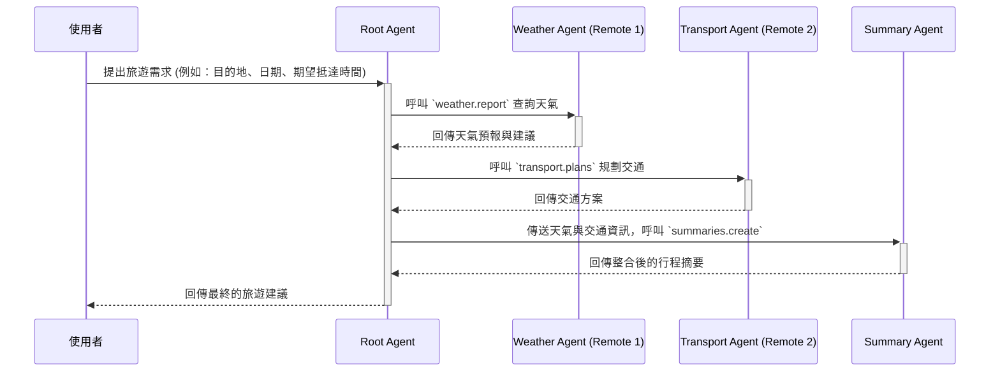

# AI Agent A2A 旅遊規劃專案

本專案是一個展示多代理（Multi-Agent）協作系統的範例，旨在模擬一個旅遊行程規劃的場景。系統中的主要協調者 `Root Agent` 會接收使用者需求，並依序呼叫其他專責的 `Remote Agents`（天氣、交通），最後由 `Summary Agent` 彙整所有資訊，產出一份完整的旅遊建議。

此專案的核心目標是展示一個清晰、可擴展的 Agent-to-Agent (A2A) 通訊架構，目前採用 **JSON-RPC 2.0** 作為主要的通訊協議。

## 系統架構

本系統採用微服務架構，由以下幾個獨立的 Agent 組成，部署於 Kubernetes (EKS) 叢集中：

| Agent                 | 容器映像檔 (Image)            | 職責                                                         |
| --------------------- | ----------------------------- | ------------------------------------------------------------ |
| **Root Agent**        | `root-agent`                  | 擔任總協調者，負責接收使用者請求、控制整體流程 (Workflow)，並與其他 Agent 溝通。 |
| **Remote Agent 1**    | `remote-agent-1`              | **天氣 Agent**：根據目的地與日期，提供天氣預報與穿著建議。   |
| **Remote Agent 2**    | `remote-agent-2`              | **交通 Agent**：根據目的地與期望抵達時間，規劃交通方案。       |
| **Summary Agent**     | `summary-agent`               | **總結 Agent**：彙整天氣與交通資訊，產出最終的行程摘要與提醒。 |
| **JSON-RPC Gateway**  | `jsonrpc_gateway`             | 提供一個簡單的客戶端與伺服器範例，用於快速測試 JSON-RPC 通訊。 |

## 運作流程

一次完整的使用者請求會經過以下流程：



文字版流程圖：
1.  **使用者** 向 `Root Agent` 發起一個任務請求，包含目的地、日期等資訊。
2.  `Root Agent` 接收到請求後，首先向 `Weather Agent` 發起 `weather.report` 的 JSON-RPC 呼叫。
3.  `Weather Agent` 回傳天氣資訊。
4.  `Root Agent` 接著向 `Transport Agent` 發起 `transport.plans` 的 JSON-RPC 呼叫。
5.  `Transport Agent` 回傳建議的交通方式。
6.  `Root Agent` 將前兩步收集到的天氣和交通資訊，傳送給 `Summary Agent`，並呼叫 `summaries.create`。
7.  `Summary Agent` 產生一段總結，並回傳給 `Root Agent`。
8.  `Root Agent` 將最終的總結回傳給使用者。

## 快速開始

請依照以下步驟在您的環境中部署與測試本專案。

### 前置需求
*   已設定好 `aws` CLI 且具備足夠的 IAM 權限。
*   已安裝 `kubectl` 並設定好 Kubeconfig 以連線到您的 EKS 叢集。
*   已安裝 `terraform`。

### 步驟 1: 部署基礎設施 (Terraform)
本專案使用 DynamoDB 作為 LangGraph Checkpointer 的後端。
```bash
# 進入 terraform 目錄
cd terraform/

# 初始化 terraform
terraform init

# 預覽即將建立的資源
terraform plan -out=ds_ddb_plan

# 建立資源
terraform apply "ds_ddb_plan"
```

### 步驟 2: 部署 Agents 到 Kubernetes
所有 Kubernetes 的部署與服務設定檔都位於 `kubernetes/` 目錄下。
```bash
# 建立專用的 namespace
kubectl apply -f kubernetes/namespace.yaml

# 部署所有 agents
kubectl apply -f kubernetes/deployment-root.yaml
kubectl apply -f kubernetes/deployment-remote1.yaml
kubectl apply -f kubernetes/deployment-remote2.yaml
kubectl apply -f kubernetes/deployment-summary.yaml

# 建立服務，讓 agents 之間可以互相溝通
kubectl apply -f kubernetes/service-root.yaml
kubectl apply -f kubernetes/service-remote1.yaml
kubectl apply -f kubernetes/service-remote2.yaml
kubectl apply -f kubernetes/service-summary.yaml
kubectl apply -f kubernetes/service-jsonrpc.yaml
```

### 步驟 3: 發送測試請求
為了方便從本地測試，我們需要使用 `port-forward` 將 `root-agent` 的服務端口轉發到本機。

1.  **開啟 Port Forward**
    ```bash
    # 將叢集內的 root-agent-jsonrpc 服務的 50000 port，轉發到您本機的 50000 port
    kubectl port-forward -n a2a-demo service/root-agent-jsonrpc 50000:50000
    ```

2.  **發送 JSON-RPC 請求**
    開啟新的終端機，使用 `curl` 或 `services/jsonrpc_gateway/client.py` 腳本發送請求。

    使用 `curl`:
    ```bash
    curl -X POST http://127.0.0.1:50000/jsonrpc \
      -H "Content-Type: application/json" \
      -d '{
            "jsonrpc": "2.0",
            "method": "a2a.submit_task",
            "params": {
              "loan_case_id": "demo-jsonrpc-001",
              "user_requirement": {
                "origin": "台北",
                "destination": "台南",
                "travel_date": "2024-10-25",
                "desired_arrival_time": "15:30"
              }
            },
            "id": 1
          }'
    ```

## 各模組詳細介紹

### Root Agent (`services/root-agent`)
*   **功能**: 整個系統的總指揮，使用 LangGraph 編排工作流程。
*   **API**:
    *   `a2a.submit_task`: 接收並啟動一個新的旅遊規劃任務。
    *   `a2a.get_task_status`: 查詢特定任務的目前狀態。
    *   `a2a.describe_agent`: 回傳此 Agent 的能力與設定。

### Weather Agent (`services/remote-agent-1`)
*   **功能**: 提供天氣資訊。
*   **API**:
    *   `weather.report`: 根據 `city`, `date`, `time_range` 參數回傳天氣報告。

### Transport Agent (`services/remote-agent-2`)
*   **功能**: 提供交通規劃。
*   **API**:
    *   `transport.plans`: 根據 `destination`, `arrival_time`, `date` 等參數回傳交通方案。

### Summary Agent (`services/summary-agent`)
*   **功能**: 彙整資訊並產生最終摘要。
*   **API**:
    *   `summaries.create`: 接收 `user_requirement`, `weather_report`, `transport` 等資訊，並回傳一段總結文字。

---
_此 README 文件由 AI Agent 自動產生與更新。_
