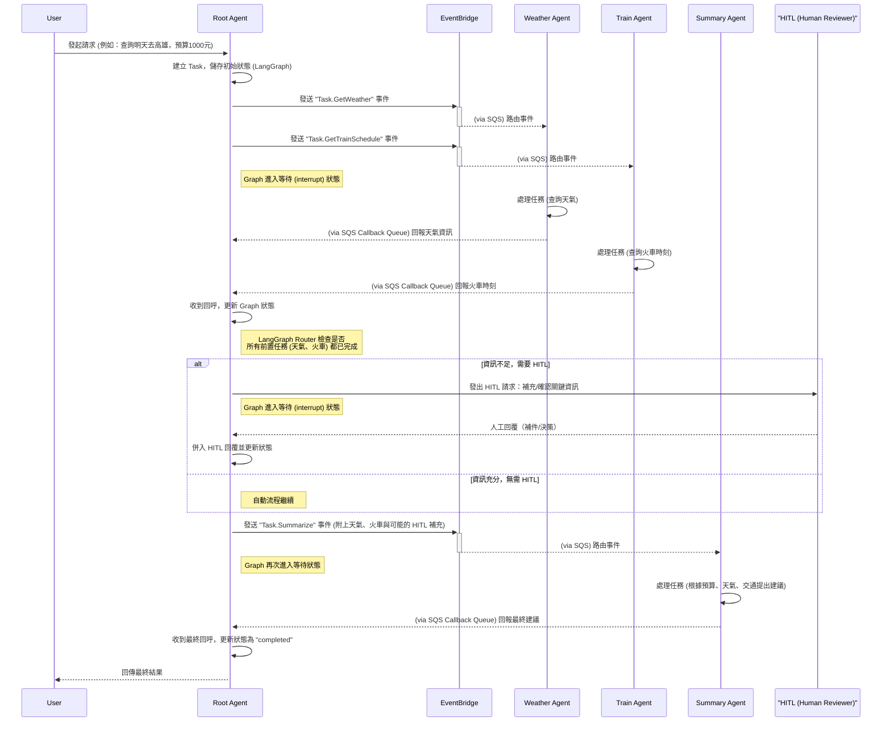

# a2a_cash_flow_demo

專案架構：

```md
a2a-ds-cashflow-demo/
├─ services/
│  ├─ root-agent/
│  │  ├─ app/
│  │  │  ├─ main.py
│  │  │  └─ a2a/
│  │  │     ├─ graph.py
│  │  │     └─ tools.py
│  │  ├─ Dockerfile
│  │  └─ requirements.txt
│  ├─ remote-agent-weather/
│  │  ├─ app/
│  │  │  ├─ main.py
│  │  │  └─ a2a/
│  │  │     └─ handlers.py
│  │  ├─ Dockerfile
│  │  └─ requirements.txt
│  ├─ remote-agent-train/
│  │  ├─ app/
│  │  │  ├─ main.py
│  │  │  └─ a2a/
│  │  │     └─ handlers.py
│  │  ├─ Dockerfile
│  │  └─ requirements.txt
│  └─ summary-agent/
│     ├─ app/
│     │  ├─ main.py
│     │  └─ a2a/
│     │     └─ handlers.py
│     ├─ Dockerfile
│     └─ requirements.txt
├─ terraform/ (完成)
│  ├─ main.tf
│  ├─ terraform.tfvars
│  └─ variables.tf
├─ kubernetes/
│  ├─ namespace.yaml
│  ├─ deployment-root.yaml
│  ├─ service-root.yaml
│  ├─ deployment-weather.yaml
│  ├─ service-weather.yaml
│  ├─ deployment-train.yaml
│  ├─ service-train.yaml
│  ├─ deployment-summary.yaml
│  └─ service-summary.yaml
└─ README.md
```


專案流程：



## Pre-request


### EKS 部署

- 先設定 kubeconfig

  `aws eks update-kubeconfig --name ds-eks-cluster --region ap-southeast-1`

  因為權限問題，須先把 AmazonSageMaker-ExecutionRole 加上對應的 EKS 的權限 （只能在 UI 介面加入 policy）

  ```json
  {
    "Version": "2012-10-17",
    "Statement": [
      {
        "Sid": "AllowDescribeSpecificCluster",
        "Effect": "Allow",
        "Action": [
          "eks:DescribeCluster"
        ],
        "Resource": "arn:aws:eks:ap-southeast-1:182399696164:cluster/ds-eks-cluster"
      },
      {
        "Sid": "OptionalListClusters",
        "Effect": "Allow",
        "Action": [
          "eks:ListClusters"
        ],
        "Resource": "*"
      }
    ]
  }
  ```

  實際執行：

  ```
  sagemaker-user@default:~$ aws eks update-kubeconfig --name ds-eks-cluster --region ap-southeast-1
  Added new context arn:aws:eks:ap-southeast-1:182399696164:cluster/ds-eks-cluster to /home/sagemaker-user/.kube/config

  # 第二次之後
  sagemaker-user@default:~$ aws eks update-kubeconfig --name ds-eks-cluster --region ap-southeast-1
  Updated context arn:aws:eks:ap-southeast-1:182399696164:cluster/ds-eks-cluster in /home/sagemaker-user/.kube/config
  ```

- 建立 namespace - 目前是士齊協助完成


### 使用 Terraform 定義和佈署 DynamoDB

- 安裝 terraform @AWS SegeMaker Studio

https://developer.hashicorp.com/terraform/install#linux

```
#安裝
wget -O - https://apt.releases.hashicorp.com/gpg | sudo gpg --dearmor -o /usr/share/keyrings/hashicorp-archive-keyring.gpg
echo "deb [arch=$(dpkg --print-architecture) signed-by=/usr/share/keyrings/hashicorp-archive-keyring.gpg] https://apt.releases.hashicorp.com $(grep -oP '(?<=UBUNTU_CODENAME=).*' /etc/os-release || lsb_release -cs) main" | sudo tee /etc/apt/sources.list.d/hashicorp.list
sudo apt update && sudo apt install terraform

#確認
sagemaker-user@default:~$ terraform -v
Terraform v1.13.3
on linux_amd64
```

ps. 通常後續需要設定 AWS 認證，但因為在 SegeMaker Studio，所以已經設定好 `aws configure` 的 `Access Key ID`、`Secret Access Key`、`Region` 等資訊。

- 執行 terraform: 

  * `terraform init`:

    這個指令會初始化您的專案，下載所需的 AWS provider。這是第一次執行時的必要步驟。

    ```
    sagemaker-user@default:~/a2a_cash_flow_demo/terraform$ terraform init
    Initializing the backend...
    Initializing provider plugins...
    - Finding latest version of hashicorp/aws...
    - Installing hashicorp/aws v6.14.1...
    - Installed hashicorp/aws v6.14.1 (signed by HashiCorp)
    Terraform has created a lock file .terraform.lock.hcl to record the provider
    selections it made above. Include this file in your version control repository
    so that Terraform can guarantee to make the same selections by default when
    you run "terraform init" in the future.

    Terraform has been successfully initialized!

    You may now begin working with Terraform. Try running "terraform plan" to see
    any changes that are required for your infrastructure. All Terraform commands
    should now work.

    If you ever set or change modules or backend configuration for Terraform,
    rerun this command to reinitialize your working directory. If you forget, other
    commands will detect it and remind you to do so if necessary.
    ```

  * `terraform plan -out=ds_ddb_plan`: 

    這個指令會生成一個執行計畫，讓您預覽 Terraform 將會做什麼。它會告訴您將會建立哪些資源，以及這些資源的詳細設定。在執行任何修改指令前，務必先 plan 一次，確認沒有錯誤。

    ```
    sagemaker-user@default:~/a2a_cash_flow_demo/terraform$ terraform plan -out=ds_ddb_plan
    Terraform used the selected providers to generate the following execution plan. Resource actions are indicated with the following symbols:
      + create

    Terraform will perform the following actions:

      # aws_dynamodb_table.a2a_audit_table will be created
      + resource "aws_dynamodb_table" "a2a_audit_table" {
          + arn              = (known after apply)
          + billing_mode     = "PAY_PER_REQUEST"
          + hash_key         = "task_id"
          + id               = (known after apply)
          + name             = "ds_demo_a2a_audit"
          + range_key        = "ts"
          + read_capacity    = (known after apply)
          + region           = "ap-southeast-1"
          + stream_arn       = (known after apply)
          + stream_label     = (known after apply)
          + stream_view_type = (known after apply)
          + tags_all         = (known after apply)
          + write_capacity   = (known after apply)

          + attribute {
              + name = "task_id"
              + type = "S"
            }
          + attribute {
              + name = "ts"
              + type = "N"
            }

          + point_in_time_recovery (known after apply)

          + server_side_encryption (known after apply)

          + ttl (known after apply)

          + warm_throughput (known after apply)
        }

      # aws_dynamodb_table.a2a_tasks_table will be created
      + resource "aws_dynamodb_table" "a2a_tasks_table" {
          + arn              = (known after apply)
          + billing_mode     = "PAY_PER_REQUEST"
          + hash_key         = "task_id"
          + id               = (known after apply)
          + name             = "ds_demo_a2a_tasks"
          + read_capacity    = (known after apply)
          + region           = "ap-southeast-1"
          + stream_arn       = (known after apply)
          + stream_label     = (known after apply)
          + stream_view_type = (known after apply)
          + tags_all         = (known after apply)
          + write_capacity   = (known after apply)

          + attribute {
              + name = "task_id"
              + type = "S"
            }

          + point_in_time_recovery (known after apply)

          + server_side_encryption (known after apply)

          + ttl (known after apply)

          + warm_throughput (known after apply)
        }

    Plan: 2 to add, 0 to change, 0 to destroy.

    Changes to Outputs:
      + a2a_audit_table_arn = (known after apply)
      + a2a_tasks_table_arn = (known after apply)

    ───────────────────────────────────────────────────────────────────────────────────────────────────────────────────────────────────────────────

    Saved the plan to: ds_ddb_plan

    To perform exactly these actions, run the following command to apply:
        terraform apply "ds_ddb_plan"
    ```

  * `terraform apply`: 如果已經建立就不能直接再建立一次，建議把手動建立的先刪除！(已手動刪除)

    這個指令會根據執行計畫實際建立您的 AWS 資源。執行後，它會再次顯示計畫並要求您輸入 yes 來確認。一旦確認，Terraform 就會開始在您的 AWS 帳戶中建立這兩個 DynamoDB 表格。

    因為少了 `dynamodb:DescribeContinuousBackups` 權限，所以要到 「IAM > Roles > AmazonSageMaker-ExecutionRole-20250915T142615 > Create policy」加上下列權限，另存成 `DynamoDBFullAccessForTerraform` policy：

    ```json
    {
        "Version": "2012-10-17",
        "Statement": [
            {
                "Effect": "Allow",
                "Action": [
                    "dynamodb:CreateTable",
                    "dynamodb:DescribeTable",
                    "dynamodb:DeleteTable",
                    "dynamodb:ListTables",
                    "dynamodb:DescribeContinuousBackups"
                ],
                "Resource": "*"
            }
        ]
    }
    ```

    執行 `terraform apply "ds_ddb_plan"` 成功

    ```
    sagemaker-user@default:~/a2a_cash_flow_demo/terraform$ terraform apply "ds_ddb_plan"
    aws_dynamodb_table.a2a_tasks_table: Creating...
    aws_dynamodb_table.a2a_audit_table: Creating...
    aws_dynamodb_table.a2a_tasks_table: Creation complete after 6s [id=ds_demo_a2a_tasks]
    aws_dynamodb_table.a2a_audit_table: Creation complete after 6s [id=ds_demo_a2a_audit]

    Apply complete! Resources: 2 added, 0 changed, 0 destroyed.

    Outputs:

    a2a_audit_table_arn = "arn:aws:dynamodb:ap-southeast-1:182399696164:table/ds_demo_a2a_audit"
    a2a_tasks_table_arn = "arn:aws:dynamodb:ap-southeast-1:182399696164:table/ds_demo_a2a_tasks"
    ```

  * `terraform output`: 

    當 apply 成功後，您可以使用這個指令查看 main.tf 中定義的輸出值。

    ```
    sagemaker-user@default:~/a2a_cash_flow_demo/terraform$ terraform output
    a2a_audit_table_arn = "arn:aws:dynamodb:ap-southeast-1:182399696164:table/ds_demo_a2a_audit"
    a2a_tasks_table_arn = "arn:aws:dynamodb:ap-southeast-1:182399696164:table/ds_demo_a2a_tasks"
    ```

